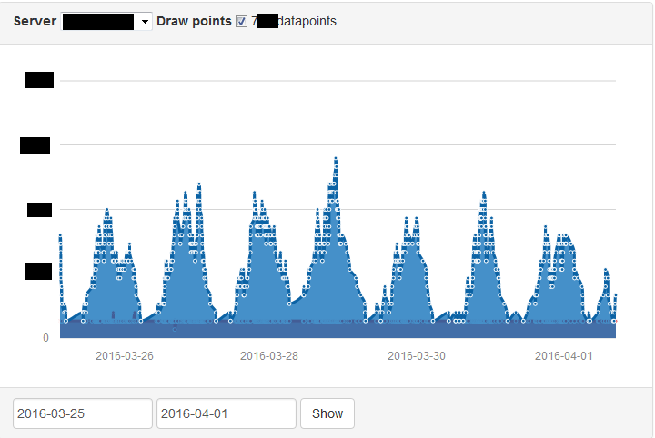

TS3 Manager
===========

A modular multi server ts3 bot running over the ts3query.  
You can easily add your own mods and functionalities by implementing the interface provided.
This project comes with 3 built in mods:
- ModStats: Statistics Bot logging the current user amount everytime one joins/leaves into MariaDB / MySQL
- ModTools: Rocket bot, it is meant more as a demo/joke and will throw a user through every (non) taken channel in a blink of a second and then kick him.
- ModDstatsEvent: Detailed stats bot, can be used to record online time of identities to decide over the next mod for example
- ModResponse: Joke bot responding to !bot (showing it's presence)
- ModTest: Test bot for the statistics module called ModTest, starting heavvy join & leave traffic triggered by the command "test DC" and stopped by "test stop"

### Structure
- Mods are loaded from <a href="src/Aron/Heinecke/ts3Manager/Mods/">../ts3Manager/Mods/</a>
  using the API declared in <a href="src/Aron/Heinecke/ts3Manager/Lib/API/">../ts3Manager/Lib/API/</a>  
  these are loaded & checked at runtime on initialization
- [Instance.java](/src/Aron/Heinecke/ts3Manager/Instance.java) Represents an instance for one Server
- [MYSQLConnector.java](/src/Aron/Heinecke/ts3Manager/Lib/MYSQLConnector.java) Is the MySQL connector keeping track of the connection state
- [TS3Connector.java](/src/Aron/Heinecke/ts3Manager/Lib/TS3Connector.java) Represents an wrapper for the ts3 connection, keeping it alive /
reconnecting if necessary

### Requirements
- JRE 8 or higher
- TS3 with query access
- TS3 whitelist access is required for high traffic bots like the rocket function
- MariaDB/MySQL at best if you want to use the built in statistics module

For compiled binaries see section "release"

### Setup
- start the bot for the first time
- edit the config file
- edit the log.xml file to change the log to your likes (verbose by default)
- restart the bot

### Notes
This is only a backend, no visualisation and/or frontend is shipped with this software.
The following is an example of how such frontend for the statistics could look like.

<a><a/> 

### Todo
Missing per-mod config & would require a major overhaul for this part

### License
APGL http://www.gnu.org/licenses/agpl.html  
Except for .jar's, and de.stefan1200.*
